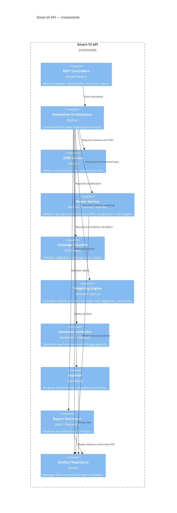

```mermaid
C4Component
    title Smart-15 API — Components

    Container_Boundary(api, "Smart-15 API") {

        Component(controller, "REST Controllers", "FastAPI Routers", "Receive requests, validate data, and return results.")

        Component(orchestrator, "Simulation Orchestrator", "Python", "Coordinates the steps of geospatial analysis.")

        Component(osmService, "OSM Service", "OSMnx", "Obtains and prepares road network and POIs.")

        Component(rasterService, "Raster Service", "Rasterio / rioxarray / stackstac", "Obtains, reprojects, and processes DEM, temperature, and imagery.")

        Component(classifier, "Coverage Classifier", "Scikit-learn", "Classifies vegetation, buildings, and surfaces.")

        Component(weighting, "Weighting Engine", "NetworkX / Python", "Calculates speeds and costs for slope, heat, vegetation, and profile.")

        Component(isochrones, "Isochrone Generator", "GeoPandas / NetworkX", "Calculates reachable areas and H3 aggregations.")

        Component(exporter, "Exporter", "GeoPandas", "Produces GeoJSON, KML, Shapefile, and ZIP files.")

        Component(report, "Report Generator", "Jinja2 / WeasyPrint", "Produces an explanatory PDF report.")

        Component(repository, "Artifact Repository", "Python", "Manages files and results for each simulation.")
    }

    Rel(controller, orchestrator, "Starts simulation")
    Rel(orchestrator, osmService, "Requests network and POIs")
    Rel(orchestrator, rasterService, "Requests environmental data")
    Rel(orchestrator, classifier, "Requests classification")
    Rel(orchestrator, weighting, "Requests network weighting")
    Rel(orchestrator, isochrones, "Requests accessibility calculation")
    Rel(orchestrator, exporter, "Requests exports")
    Rel(orchestrator, report, "Requests report")
    Rel(osmService, repository, "Writes artifacts")
    Rel(rasterService, repository, "Writes processed rasters")
    Rel(exporter, repository, "Writes files")
    Rel(report, repository, "Reads indicators and writes PDF")
```
