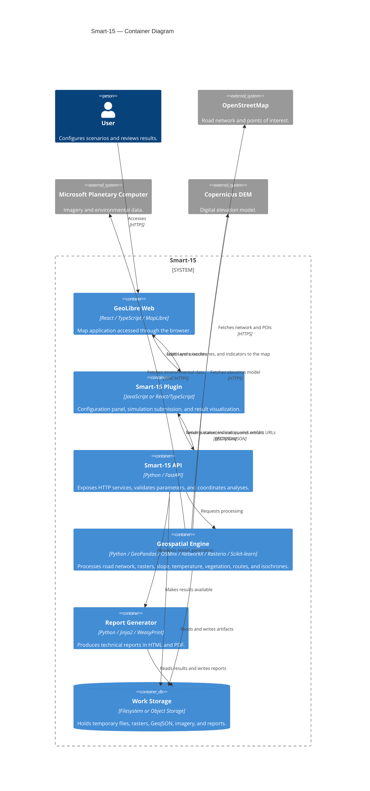

```mermaid
C4Container
    title Smart-15 — Container Diagram

    Person(usuario, "User", "Configures scenarios and reviews results.")

    System_Ext(osm, "OpenStreetMap", "Road network and points of interest.")
    System_Ext(planetary, "Microsoft Planetary Computer", "Imagery and environmental data.")
    System_Ext(copernicus, "Copernicus DEM", "Digital elevation model.")

    System_Boundary(smart15, "Smart-15") {

        Container(web, "GeoLibre Web", "React / TypeScript / MapLibre", "Map application accessed through the browser.")

        Container(plugin, "Smart-15 Plugin", "JavaScript or React/TypeScript", "Configuration panel, simulation submission, and result visualization.")

        Container(api, "Smart-15 API", "Python / FastAPI", "Exposes HTTP services, validates parameters, and coordinates analyses.")

        Container(engine, "Geospatial Engine", "Python / GeoPandas / OSMnx / NetworkX / Rasterio / Scikit-learn", "Processes road network, rasters, slope, temperature, vegetation, routes, and isochrones.")

        Container(report, "Report Generator", "Python / Jinja2 / WeasyPrint", "Produces technical reports in HTML and PDF.")

        ContainerDb(storage, "Work Storage", "Filesystem or Object Storage", "Holds temporary files, rasters, GeoJSON, imagery, and reports.")
    }

    Rel(usuario, web, "Accesses", "HTTPS")
    Rel(web, plugin, "Loads and executes")
    Rel(plugin, api, "Sends parameters and queries results", "REST/JSON")
    Rel(api, engine, "Requests processing")
    Rel(api, report, "Requests report generation")
    Rel(engine, osm, "Fetches network and POIs", "HTTPS")
    Rel(engine, planetary, "Fetches environmental data", "STAC/HTTPS")
    Rel(engine, copernicus, "Fetches elevation model", "HTTPS")
    Rel(engine, storage, "Reads and writes artifacts")
    Rel(report, storage, "Reads results and writes reports")
    Rel(api, storage, "Makes results available")
    Rel(api, plugin, "Returns status, indicators, and artifact URLs", "JSON/GeoJSON")
    Rel(plugin, web, "Adds layers, isochrones, and indicators to the map")
```
