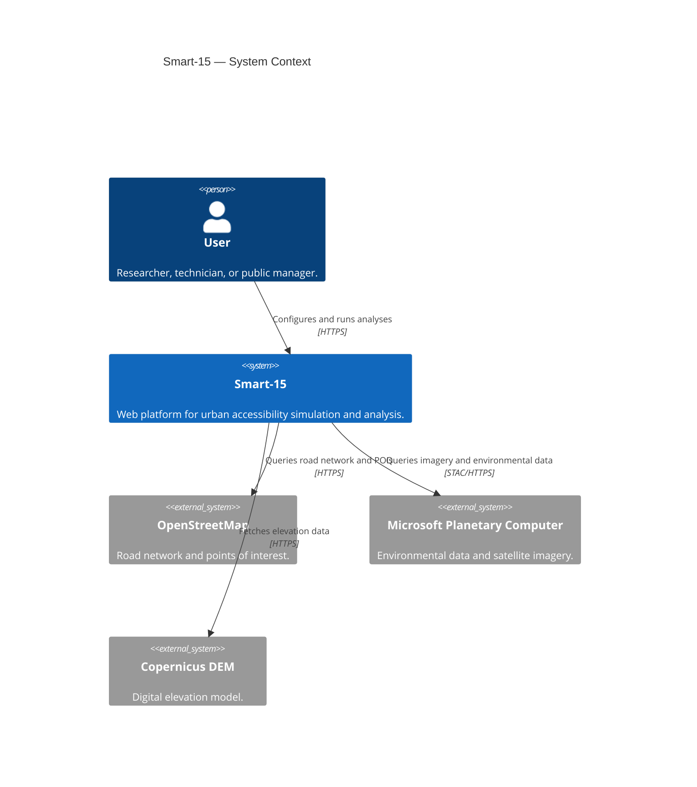

```mermaid
C4Context
    title Smart-15 — System Context

    Person(usuario, "User", "Researcher, technician, or public manager.")

    System(smart15, "Smart-15", "Web platform for urban accessibility simulation and analysis.")

    System_Ext(osm, "OpenStreetMap", "Road network and points of interest.")
    System_Ext(planetary, "Microsoft Planetary Computer", "Environmental data and satellite imagery.")
    System_Ext(copernicus, "Copernicus DEM", "Digital elevation model.")

    Rel(usuario, smart15, "Configures and runs analyses", "HTTPS")
    Rel(smart15, osm, "Queries road network and POIs", "HTTPS")
    Rel(smart15, planetary, "Queries imagery and environmental data", "STAC/HTTPS")
    Rel(smart15, copernicus, "Fetches elevation data", "HTTPS")
    
```
